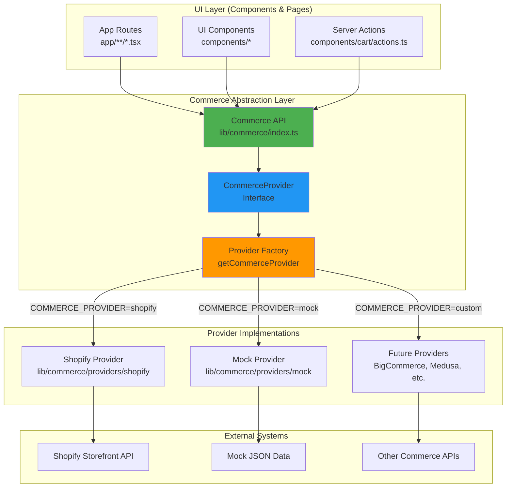

# Design Document - Remove Shopify Dependencies

## Overview

This design transforms the Next.js Commerce application from a Shopify-only implementation to a platform-agnostic ecommerce template by introducing a commerce abstraction layer. The design follows the "provider pattern" where different commerce backends (Shopify, mock, custom) can be plugged in via a common interface.

**Key Design Principles:**
- **Preserve existing functionality**: Current Shopify users experience no breaking changes
- **Clean abstraction boundaries**: UI components never directly import provider implementations
- **Type safety throughout**: Full TypeScript coverage for all provider operations
- **Zero runtime overhead**: Unused providers are tree-shaken from production bundles
- **Progressive migration**: Can be implemented incrementally without breaking the application

## Steering Document Alignment

### Technical Standards (tech.md)

**Alignment with Architecture Patterns:**
- **Modular Design**: Provider interface lives in `lib/commerce/`, matching the existing `lib/shopify/` pattern
- **Type Safety**: Leverages existing strict TypeScript configuration with explicit interface contracts
- **Server Components First**: All provider methods remain server-side, preserving SSR benefits
- **Caching Strategy**: Maintains Next.js cache tags (`TAGS.products`, `TAGS.collections`, `TAGS.cart`) across all providers
- **Error Handling**: Normalizes provider-specific errors into common error types, similar to existing `isShopifyError` pattern

**Tech Stack Compatibility:**
- Uses existing Next.js 15.3 App Router features (`"use cache"`, `cacheTag`, `revalidateTag`)
- Maintains React 19 Server Components/Server Actions architecture
- Preserves TypeScript strict mode and type augmentation patterns
- Compatible with current pnpm workspace structure

### Project Structure (structure.md)

**File Organization:**
```
lib/
├── commerce/                          # New abstraction layer
│   ├── index.ts                       # Provider factory & exports
│   ├── types.ts                       # Generic commerce DTOs
│   ├── errors.ts                      # Standardized error types
│   ├── provider.interface.ts          # CommerceProvider interface
│   ├── config.ts                      # Provider selection logic
│   └── providers/
│       ├── README.md                  # Provider implementation guide
│       ├── shopify/                   # Shopify implementation (migrated)
│       │   ├── index.ts               # Implements CommerceProvider
│       │   ├── client.ts              # GraphQL fetch logic
│       │   ├── types.ts               # Shopify-specific types
│       │   ├── reshaping.ts           # Data transformation helpers
│       │   ├── queries/
│       │   ├── mutations/
│       │   └── fragments/
│       └── mock/                      # Mock provider for dev/testing
│           ├── index.ts               # Implements CommerceProvider
│           ├── data.ts                # Static mock data
│           └── README.md              # Usage instructions
├── shopify/ (deprecated)              # Will be removed after migration
└── constants.ts                       # Shared constants (TAGS, etc.)
```

**Naming Conventions:**
- Interface: `CommerceProvider` (PascalCase)
- Factory function: `getCommerceProvider()` (camelCase)
- Provider files: `kebab-case.ts` (matching existing pattern)
- Environment variables: `UPPER_SNAKE_CASE` (e.g., `COMMERCE_PROVIDER`)

**Import Patterns:**
- Components import from `lib/commerce` only (never `lib/commerce/providers/*`)
- Absolute imports via `@/lib/commerce` for cross-feature dependencies
- Provider implementations can use relative imports internally

## Code Reuse Analysis

### Existing Components to Leverage

**1. Type Definitions (lib/shopify/types.ts)**
- **Reuse Strategy**: Generic types (`Cart`, `Product`, `Collection`, `Image`, `Money`, `Page`) will be moved to `lib/commerce/types.ts` unchanged
- **Benefit**: UI components already use these types, so no refactoring needed
- **Migration**: Provider-specific types (prefixed with `Shopify*`) stay in `lib/commerce/providers/shopify/types.ts`

**2. Data Reshaping Utilities (lib/shopify/index.ts)**
- **Reuse Strategy**: Extract `removeEdgesAndNodes<T>()` to `lib/commerce/utils.ts` as it's a common GraphQL pattern
- **Shopify-specific reshaping** (`reshapeCart`, `reshapeProduct`, etc.) moves to `lib/commerce/providers/shopify/reshaping.ts`
- **Benefit**: Other GraphQL-based providers can reuse edge/node flattening logic

**3. Caching Infrastructure**
- **Reuse Strategy**: Keep `TAGS` constant in `lib/constants.ts` - it's provider-agnostic
- **All providers** must respect Next.js cache tags for consistency
- **Benefit**: Unified cache invalidation across providers via `revalidateTag(TAGS.products)`

**4. Error Handling Patterns**
- **Reuse Strategy**: Generalize `isShopifyError` type guard to `isCommerceError` in `lib/commerce/errors.ts`
- **Provider errors** get normalized to `CommerceError` type with standard fields (message, code, cause)
- **Benefit**: UI components handle errors uniformly regardless of provider

### Existing Components Requiring Updates

**1. Cart Server Actions (components/cart/actions.ts)**
- **Current**: `import { addToCart, getCart } from "lib/shopify"`
- **Update**: `import { commerce } from "@/lib/commerce"` → `commerce.addToCart()`, `commerce.getCart()`
- **Impact**: 6 import statements, ~10 function calls

**2. Product/Collection Queries (app/*/page.tsx files)**
- **Current**: Direct imports from `lib/shopify`
- **Update**: Import from `lib/commerce` instead
- **Impact**: ~15 files across `app/` directory

**3. API Route Handlers (app/api/revalidate/route.ts)**
- **Current**: `import { revalidate } from "lib/shopify"`
- **Update**: `commerce.revalidate(req)` generic method
- **Impact**: 1 file, provider handles webhook verification internally

### Integration Points

**1. Next.js Caching System**
- **Integration**: Provider methods must wrap queries with `"use cache"`, `cacheTag()`, `cacheLife()`
- **Validation**: Factory function validates provider exports use caching primitives correctly
- **Consistency**: All providers must tag with `TAGS.products`, `TAGS.collections`, etc.

**2. Cookie-Based Cart Management**
- **Integration**: `getCart()` reads `cartId` from cookies (provider-agnostic)
- **Cart mutations**: Provider responsible for updating cart, application handles cookie lifecycle
- **User sync**: Cart sync to file storage (`lib/user/cart-storage.ts`) works with generic `Cart` DTO

**3. Environment Variable Validation**
- **Integration**: `lib/utils.ts` validates env vars based on active provider
- **Provider-specific**: Each provider exports `requiredEnvVars` array
- **Startup check**: Application fails fast with clear error if provider is misconfigured

## Architecture

### System Architecture Diagram



### Modular Design Principles

**Single File Responsibility:**
- `lib/commerce/index.ts`: Provider factory and public API exports only
- `lib/commerce/types.ts`: Generic commerce DTOs (no implementation logic)
- `lib/commerce/provider.interface.ts`: Interface definition only
- `lib/commerce/config.ts`: Environment-based provider selection logic
- `lib/commerce/errors.ts`: Error types and normalization utilities

**Component Isolation:**
- Each provider is self-contained in `lib/commerce/providers/[name]/`
- Providers cannot import from each other (prevents coupling)
- Providers can only import from `lib/commerce/*.ts` (types, errors)

**Service Layer Separation:**
- **Data Access**: Provider implementations handle external API calls
- **Business Logic**: Reshaping/validation happens within provider layer
- **Presentation**: Components receive pre-shaped DTOs, no provider awareness

**Utility Modularity:**
- Shared utilities (`removeEdgesAndNodes`, error normalization) live in `lib/commerce/utils.ts`
- Provider-specific utilities stay within provider directory
- No circular dependencies between utilities and providers

## Components and Interfaces

### Component 1: CommerceProvider Interface

**Purpose:** Define the contract all commerce providers must implement

**File:** `lib/commerce/provider.interface.ts`

**Interface Definition:**
```typescript
export interface CommerceProvider {
  name: string;
  requiredEnvVars: string[];

  // Cart Operations
  createCart(): Promise<Cart>;
  getCart(cartId?: string): Promise<Cart | undefined>;
  addToCart(lines: CartLineInput[]): Promise<Cart>;
  updateCart(lines: CartLineUpdateInput[]): Promise<Cart>;
  removeFromCart(lineIds: string[]): Promise<Cart>;

  // Product Operations
  getProduct(handle: string): Promise<Product | undefined>;
  getProducts(options: ProductQueryOptions): Promise<Product[]>;
  getProductRecommendations(productId: string): Promise<Product[]>;

  // Collection Operations
  getCollection(handle: string): Promise<Collection | undefined>;
  getCollections(): Promise<Collection[]>;
  getCollectionProducts(options: CollectionQueryOptions): Promise<Product[]>;

  // Content Operations
  getPage(handle: string): Promise<Page>;
  getPages(): Promise<Page[]>;
  getMenu(handle: string): Promise<Menu[]>;

  // Webhook/Revalidation
  revalidate(req: NextRequest): Promise<NextResponse>;
}
```

**Dependencies:**
- `lib/commerce/types.ts` for DTO definitions
- Next.js types for `NextRequest`, `NextResponse`

**Reuses:** None (this is the foundational interface)

### Component 2: Provider Factory

**Purpose:** Select and instantiate the correct provider based on environment configuration

**File:** `lib/commerce/config.ts`

**Implementation Strategy:**
```typescript
import type { CommerceProvider } from './provider.interface';

const PROVIDERS = {
  shopify: () => import('./providers/shopify'),
  mock: () => import('./providers/mock'),
} as const;

export type ProviderName = keyof typeof PROVIDERS;

export async function getCommerceProvider(): Promise<CommerceProvider> {
  const providerName = (process.env.COMMERCE_PROVIDER as ProviderName) || 'mock';

  if (!(providerName in PROVIDERS)) {
    throw new Error(
      `Unknown commerce provider: "${providerName}". ` +
      `Available providers: ${Object.keys(PROVIDERS).join(', ')}`
    );
  }

  const providerModule = await PROVIDERS[providerName]();
  const provider = providerModule.default;

  // Validate required environment variables
  validateProviderEnv(provider);

  return provider;
}

function validateProviderEnv(provider: CommerceProvider): void {
  const missing = provider.requiredEnvVars.filter(key => !process.env[key]);

  if (missing.length > 0) {
    throw new Error(
      `Provider "${provider.name}" is missing required environment variables: ` +
      missing.join(', ')
    );
  }
}
```

**Dependencies:**
- `lib/commerce/provider.interface.ts`
- Dynamic imports for tree-shaking

**Reuses:**
- Extends existing `lib/utils.ts` validation patterns
- Similar to existing `ensureStartsWith` helper pattern

### Component 3: Commerce API Facade

**Purpose:** Provide a singleton instance of the active provider for application-wide use

**File:** `lib/commerce/index.ts`

**Implementation Strategy:**
```typescript
import { getCommerceProvider } from './config';
import type { CommerceProvider } from './provider.interface';

let cachedProvider: CommerceProvider | null = null;

export async function getCommerce(): Promise<CommerceProvider> {
  if (!cachedProvider) {
    cachedProvider = await getCommerceProvider();

    if (process.env.NODE_ENV === 'development') {
      console.log(`[Commerce] Using provider: ${cachedProvider.name}`);
    }
  }

  return cachedProvider;
}

// Re-export types for convenience
export * from './types';
export * from './errors';
export type { CommerceProvider } from './provider.interface';
```

**Dependencies:**
- `lib/commerce/config.ts` for provider selection
- `lib/commerce/types.ts` for type exports

**Reuses:** Caching pattern similar to Next.js module-level caching

**Usage in Components:**
```typescript
// Before (Shopify-specific):
import { getProduct } from 'lib/shopify';

// After (Provider-agnostic):
import { getCommerce } from '@/lib/commerce';

const commerce = await getCommerce();
const product = await commerce.getProduct(handle);
```

### Component 4: Shopify Provider Implementation

**Purpose:** Wrap existing Shopify logic in the CommerceProvider interface

**File:** `lib/commerce/providers/shopify/index.ts`

**Implementation Strategy:**
```typescript
import type { CommerceProvider } from '../../provider.interface';
import { shopifyFetch } from './client';
import { reshapeCart, reshapeProduct, reshapeCollection } from './reshaping';
import * as queries from './queries';
import * as mutations from './mutations';

const shopifyProvider: CommerceProvider = {
  name: 'shopify',
  requiredEnvVars: [
    'SHOPIFY_STORE_DOMAIN',
    'SHOPIFY_STOREFRONT_ACCESS_TOKEN',
  ],

  async createCart() {
    const res = await shopifyFetch({ query: mutations.createCart });
    return reshapeCart(res.body.data.cartCreate.cart);
  },

  async getCart(cartId) {
    if (!cartId) return undefined;
    const res = await shopifyFetch({
      query: queries.getCart,
      variables: { cartId },
    });
    return res.body.data.cart ? reshapeCart(res.body.data.cart) : undefined;
  },

  // ... implement all other interface methods
};

export default shopifyProvider;
```

**Dependencies:**
- Existing Shopify GraphQL queries/mutations (moved to provider directory)
- Existing reshaping functions (moved to `reshaping.ts`)
- `shopifyFetch` helper (refactored from current implementation)

**Reuses:**
- 100% of existing Shopify logic - just reorganized
- All existing queries, mutations, fragments preserved
- Existing error handling with `isShopifyError` type guard

### Component 5: Mock Provider Implementation

**Purpose:** Provide fake data for local development and testing without external dependencies

**File:** `lib/commerce/providers/mock/index.ts`

**Implementation Strategy:**
```typescript
import type { CommerceProvider } from '../../provider.interface';
import { mockProducts, mockCollections, mockCart } from './data';

const mockProvider: CommerceProvider = {
  name: 'mock',
  requiredEnvVars: [], // No external dependencies

  async createCart() {
    return { ...mockCart, id: crypto.randomUUID() };
  },

  async getCart(cartId) {
    // Simulate cart retrieval from memory/storage
    return cartId ? mockCart : undefined;
  },

  async addToCart(lines) {
    // Simulate adding items with realistic delay
    await new Promise(resolve => setTimeout(resolve, 100));
    return {
      ...mockCart,
      lines: [...mockCart.lines, ...lines.map(toMockCartItem)],
    };
  },

  async getProduct(handle) {
    return mockProducts.find(p => p.handle === handle);
  },

  async getProducts(options) {
    let products = mockProducts;

    if (options.query) {
      products = products.filter(p =>
        p.title.toLowerCase().includes(options.query.toLowerCase())
      );
    }

    if (options.sortKey === 'PRICE') {
      products.sort((a, b) =>
        parseFloat(a.priceRange.minVariantPrice.amount) -
        parseFloat(b.priceRange.minVariantPrice.amount)
      );
    }

    if (options.reverse) {
      products.reverse();
    }

    return products;
  },

  async revalidate(req) {
    console.log('[Mock Provider] Revalidation webhook received (no-op)');
    return NextResponse.json({ status: 200, mock: true });
  },

  // ... implement all other interface methods with mock data
};

export default mockProvider;
```

**Dependencies:**
- `lib/commerce/providers/mock/data.ts` with realistic mock data

**Reuses:**
- Generic `Cart`, `Product`, `Collection` types from `lib/commerce/types.ts`
- `NextResponse` patterns from existing API routes

**Mock Data Structure (`data.ts`):**
```typescript
import type { Product, Collection, Cart } from '../../types';

export const mockProducts: Product[] = [
  {
    id: 'mock-product-1',
    handle: 'acme-tshirt',
    title: 'Acme T-Shirt',
    description: 'A comfortable cotton t-shirt',
    availableForSale: true,
    priceRange: {
      minVariantPrice: { amount: '25.00', currencyCode: 'USD' },
      maxVariantPrice: { amount: '25.00', currencyCode: 'USD' },
    },
    variants: [
      {
        id: 'mock-variant-1',
        title: 'Small',
        availableForSale: true,
        selectedOptions: [{ name: 'Size', value: 'Small' }],
        price: { amount: '25.00', currencyCode: 'USD' },
      },
      // ... more variants
    ],
    images: [
      {
        url: 'https://via.placeholder.com/800x800?text=T-Shirt',
        altText: 'Acme T-Shirt',
        width: 800,
        height: 800,
      },
    ],
    // ... more product data
  },
  // ... more products
];

export const mockCollections: Collection[] = [ /* ... */ ];
export const mockCart: Cart = { /* ... */ };
```

### Component 6: Generic Commerce Types

**Purpose:** Define provider-agnostic data transfer objects used throughout the application

**File:** `lib/commerce/types.ts`

**Type Definitions:**
```typescript
// Core DTOs (moved from lib/shopify/types.ts)
export type Cart = {
  id: string | undefined;
  checkoutUrl: string;
  cost: {
    subtotalAmount: Money;
    totalAmount: Money;
    totalTaxAmount: Money;
  };
  lines: CartItem[];
  totalQuantity: number;
};

export type CartItem = {
  id: string | undefined;
  quantity: number;
  cost: {
    totalAmount: Money;
  };
  merchandise: {
    id: string;
    title: string;
    selectedOptions: { name: string; value: string }[];
    product: CartProduct;
  };
};

export type Product = {
  id: string;
  handle: string;
  availableForSale: boolean;
  title: string;
  description: string;
  descriptionHtml: string;
  options: ProductOption[];
  priceRange: {
    maxVariantPrice: Money;
    minVariantPrice: Money;
  };
  variants: ProductVariant[];
  featuredImage: Image;
  images: Image[];
  seo: SEO;
  tags: string[];
  updatedAt: string;
};

export type Collection = {
  handle: string;
  title: string;
  description: string;
  seo: SEO;
  updatedAt: string;
  path: string;
};

// Input types for mutations
export type CartLineInput = {
  merchandiseId: string;
  quantity: number;
};

export type CartLineUpdateInput = {
  id: string;
  merchandiseId: string;
  quantity: number;
};

// Query option types
export type ProductQueryOptions = {
  query?: string;
  reverse?: boolean;
  sortKey?: string;
};

export type CollectionQueryOptions = {
  collection: string;
  reverse?: boolean;
  sortKey?: string;
};

// Utility types
export type Money = {
  amount: string;
  currencyCode: string;
};

export type Image = {
  url: string;
  altText: string;
  width: number;
  height: number;
};

export type SEO = {
  title: string;
  description: string;
};

export type Page = {
  id: string;
  title: string;
  handle: string;
  body: string;
  bodySummary: string;
  seo?: SEO;
  createdAt: string;
  updatedAt: string;
};

export type Menu = {
  title: string;
  path: string;
};
```

**Dependencies:** None (pure type definitions)

**Reuses:** Existing types from `lib/shopify/types.ts` (moved unchanged)

### Component 7: Standardized Error Handling

**Purpose:** Normalize provider-specific errors into a consistent format

**File:** `lib/commerce/errors.ts`

**Implementation:**
```typescript
export class CommerceError extends Error {
  constructor(
    message: string,
    public code: string,
    public status: number = 500,
    public cause?: unknown,
  ) {
    super(message);
    this.name = 'CommerceError';
  }
}

export function isCommerceError(error: unknown): error is CommerceError {
  return error instanceof CommerceError;
}

export function normalizeError(error: unknown, providerName: string): CommerceError {
  if (isCommerceError(error)) {
    return error;
  }

  // Handle provider-specific errors
  if (typeof error === 'object' && error !== null) {
    const err = error as Record<string, any>;
    return new CommerceError(
      err.message || 'Unknown commerce error',
      `${providerName.toUpperCase()}_ERROR`,
      err.status || 500,
      error,
    );
  }

  return new CommerceError(
    'An unexpected error occurred',
    'UNKNOWN_ERROR',
    500,
    error,
  );
}
```

**Dependencies:** None

**Reuses:** Pattern from existing `isShopifyError` type guard in `lib/type-guards.ts`

## Data Models

### Cart Model
```typescript
Cart {
  id: string | undefined              // Provider-specific cart ID
  checkoutUrl: string                 // URL to complete checkout on provider platform
  cost: {
    subtotalAmount: Money             // Subtotal before tax/shipping
    totalAmount: Money                // Final total including tax
    totalTaxAmount: Money             // Tax amount
  }
  lines: CartItem[]                   // Cart line items (flattened, not Connection)
  totalQuantity: number               // Total item count across all lines
}
```

**Usage:** Cart state in `CartContext`, server actions, checkout flows

**Provider Responsibilities:**
- Generate unique cart IDs
- Calculate totals and tax
- Provide valid checkout URLs
- Persist cart state (or rely on cookies for stateless)

### Product Model
```typescript
Product {
  id: string                          // Provider-specific product ID
  handle: string                      // URL-friendly slug
  availableForSale: boolean           // Stock availability
  title: string                       // Display name
  description: string                 // Plain text description
  descriptionHtml: string             // Rich HTML description
  options: ProductOption[]            // Variant options (Size, Color, etc.)
  priceRange: {
    maxVariantPrice: Money            // Highest price across variants
    minVariantPrice: Money            // Lowest price across variants
  }
  variants: ProductVariant[]          // Available variants (flattened)
  featuredImage: Image                // Main product image
  images: Image[]                     // All product images (flattened)
  seo: SEO                            // Meta tags for SEO
  tags: string[]                      // Product tags/categories
  updatedAt: string                   // ISO 8601 timestamp
}
```

**Usage:** Product detail pages, product grids, search results

**Provider Responsibilities:**
- Flatten GraphQL connections (if applicable)
- Generate alt text for images if missing
- Filter hidden products (e.g., `HIDDEN_PRODUCT_TAG`)
- Normalize variant data structure

### Collection Model
```typescript
Collection {
  handle: string                      // URL-friendly slug
  title: string                       // Display name
  description: string                 // Collection description
  seo: SEO                            // Meta tags for SEO
  updatedAt: string                   // ISO 8601 timestamp
  path: string                        // Internal route path (e.g., "/search/shirts")
}
```

**Usage:** Collection listing pages, navigation menus, filtering

**Provider Responsibilities:**
- Map provider collections to internal path structure
- Filter hidden collections (e.g., `hidden-*` prefix)
- Include synthetic "All Products" collection if needed

## Error Handling

### Error Scenarios

#### 1. Provider Configuration Error
**Description:** Application starts with invalid or missing provider configuration

**Handling:**
```typescript
// In lib/commerce/config.ts
if (!(providerName in PROVIDERS)) {
  throw new Error(
    `Unknown commerce provider: "${providerName}". ` +
    `Available providers: ${Object.keys(PROVIDERS).join(', ')}`
  );
}
```

**User Impact:**
- Development: Clear error in terminal with list of valid providers
- Production: Application fails to start (prevents serving broken site)

#### 2. Missing Environment Variables
**Description:** Provider requires env vars that are not set (e.g., `SHOPIFY_STOREFRONT_ACCESS_TOKEN`)

**Handling:**
```typescript
function validateProviderEnv(provider: CommerceProvider): void {
  const missing = provider.requiredEnvVars.filter(key => !process.env[key]);

  if (missing.length > 0) {
    throw new Error(
      `Provider "${provider.name}" is missing required environment variables: ` +
      missing.join(', ') +
      `\n\nCheck your .env file or environment configuration.`
    );
  }
}
```

**User Impact:**
- Development: Clear error listing missing variables
- Production: Build fails (Vercel deployment blocked until env vars are set)

#### 3. Provider API Failure
**Description:** External commerce API returns an error (network issue, invalid credentials, rate limit)

**Handling:**
```typescript
// In provider implementation:
try {
  const result = await fetch(apiEndpoint, { ... });
  const body = await result.json();

  if (body.errors) {
    throw normalizeError(body.errors[0], this.name);
  }

  return body;
} catch (e) {
  throw normalizeError(e, this.name);
}
```

**User Impact:**
- User sees generic error toast: "Failed to load products. Please try again."
- Error logged server-side with provider context for debugging
- Page shows cached data or empty state (graceful degradation)

#### 4. Cart Not Found
**Description:** User's cart ID cookie points to a deleted or expired cart

**Handling:**
```typescript
export async function getCart(cartId?: string): Promise<Cart | undefined> {
  if (!cartId) return undefined;

  try {
    const cart = await provider.getCart(cartId);
    return cart;
  } catch (e) {
    // Cart doesn't exist - return undefined, let app create new one
    if (isCommerceError(e) && e.code === 'NOT_FOUND') {
      return undefined;
    }
    throw e;
  }
}
```

**User Impact:**
- Silent recovery: Create new cart automatically
- User's cart appears empty (acceptable for expired carts)
- No error message shown (expected behavior)

#### 5. Unsupported Provider Method
**Description:** A provider doesn't implement a method (e.g., mock provider's `revalidate()` is a no-op)

**Handling:**
```typescript
// In provider implementation:
async revalidate(req: NextRequest): Promise<NextResponse> {
  console.warn(`[${this.name}] Revalidation not supported (no-op)`);
  return NextResponse.json({ status: 200, mock: true });
}
```

**User Impact:**
- Development: Console warning logged
- Production: Request succeeds (200), cache not invalidated (acceptable for mock data)
- No breaking errors

#### 6. Type Mismatch in Provider Response
**Description:** Provider returns data that doesn't match expected DTO shape

**Handling:**
```typescript
// In reshaping functions:
function reshapeProduct(rawProduct: unknown): Product {
  // Runtime validation
  if (!rawProduct || typeof rawProduct !== 'object') {
    throw new CommerceError(
      'Invalid product data received from provider',
      'INVALID_DATA',
      500,
    );
  }

  // Use type guards and defaults
  return {
    id: rawProduct.id ?? '',
    handle: rawProduct.handle ?? '',
    title: rawProduct.title ?? 'Untitled Product',
    // ... with safe defaults
  };
}
```

**User Impact:**
- Development: Error logged with details about missing fields
- Production: Product shown with safe defaults (better than crash)
- Sentry/logging captures issue for provider implementation fix

## Testing Strategy

### Unit Testing

**Approach:** Test provider interface compliance and data transformation logic

**Key Components to Test:**

1. **Provider Factory (`lib/commerce/config.ts`)**
   ```typescript
   describe('getCommerceProvider', () => {
     it('should throw error for unknown provider', async () => {
       process.env.COMMERCE_PROVIDER = 'invalid';
       await expect(getCommerceProvider()).rejects.toThrow('Unknown commerce provider');
     });

     it('should load shopify provider when configured', async () => {
       process.env.COMMERCE_PROVIDER = 'shopify';
       const provider = await getCommerceProvider();
       expect(provider.name).toBe('shopify');
     });

     it('should validate required env vars', async () => {
       process.env.COMMERCE_PROVIDER = 'shopify';
       delete process.env.SHOPIFY_STOREFRONT_ACCESS_TOKEN;
       await expect(getCommerceProvider()).rejects.toThrow('missing required environment variables');
     });
   });
   ```

2. **Error Normalization (`lib/commerce/errors.ts`)**
   ```typescript
   describe('normalizeError', () => {
     it('should wrap provider errors in CommerceError', () => {
       const shopifyError = { message: 'Product not found', status: 404 };
       const normalized = normalizeError(shopifyError, 'shopify');
       expect(normalized).toBeInstanceOf(CommerceError);
       expect(normalized.code).toBe('SHOPIFY_ERROR');
     });
   });
   ```

3. **Mock Provider (`lib/commerce/providers/mock/index.ts`)**
   ```typescript
   describe('mockProvider', () => {
     it('should return mock products for getProducts', async () => {
       const products = await mockProvider.getProducts({});
       expect(products).toBeInstanceOf(Array);
       expect(products[0]).toHaveProperty('handle');
     });

     it('should filter products by search query', async () => {
       const results = await mockProvider.getProducts({ query: 'shirt' });
       results.forEach(p => {
         expect(p.title.toLowerCase()).toContain('shirt');
       });
     });
   });
   ```

4. **Shopify Provider Reshaping (`lib/commerce/providers/shopify/reshaping.ts`)**
   ```typescript
   describe('reshapeProduct', () => {
     it('should flatten variants connection', () => {
       const shopifyProduct = {
         variants: {
           edges: [
             { node: { id: '1', title: 'Small' } },
             { node: { id: '2', title: 'Large' } },
           ],
         },
       };
       const reshaped = reshapeProduct(shopifyProduct);
       expect(reshaped.variants).toEqual([
         { id: '1', title: 'Small' },
         { id: '2', title: 'Large' },
       ]);
     });
   });
   ```

### Integration Testing

**Approach:** Test provider interactions with Next.js framework features

**Key Flows to Test:**

1. **Cart Server Actions with Mock Provider**
   ```typescript
   describe('Cart Actions', () => {
     beforeEach(() => {
       process.env.COMMERCE_PROVIDER = 'mock';
     });

     it('should add item to cart via server action', async () => {
       const formData = new FormData();
       formData.append('merchandiseId', 'mock-variant-1');

       const result = await addItem(null, 'mock-variant-1');
       expect(result).toBeUndefined(); // Success returns void

       const cart = await getCart();
       expect(cart?.lines).toHaveLength(1);
     });
   });
   ```

2. **Cache Tag Revalidation**
   ```typescript
   describe('Revalidation', () => {
     it('should revalidate product cache on webhook', async () => {
       const req = new NextRequest('http://localhost/api/revalidate?secret=test', {
         headers: { 'x-shopify-topic': 'products/update' },
       });

       const response = await shopifyProvider.revalidate(req);
       expect(response.status).toBe(200);
       // Verify revalidateTag was called with TAGS.products
     });
   });
   ```

3. **Provider Selection Based on Environment**
   ```typescript
   describe('Provider Selection', () => {
     it('should use mock provider when no env var is set', async () => {
       delete process.env.COMMERCE_PROVIDER;
       const provider = await getCommerceProvider();
       expect(provider.name).toBe('mock');
     });

     it('should use shopify provider when explicitly set', async () => {
       process.env.COMMERCE_PROVIDER = 'shopify';
       process.env.SHOPIFY_STOREFRONT_ACCESS_TOKEN = 'test';
       process.env.SHOPIFY_STORE_DOMAIN = 'test.myshopify.com';

       const provider = await getCommerceProvider();
       expect(provider.name).toBe('shopify');
     });
   });
   ```

### End-to-End Testing

**Approach:** Test user-facing flows with real provider interactions

**User Scenarios to Test:**

1. **Browse and Add to Cart Flow**
   ```typescript
   test('user can browse products and add to cart', async ({ page }) => {
     await page.goto('/');

     // Click on a product
     await page.click('[data-testid="product-card"]');

     // Select variant
     await page.click('[data-testid="variant-small"]');

     // Add to cart
     await page.click('[data-testid="add-to-cart"]');

     // Verify toast notification
     await expect(page.locator('text=Added to cart')).toBeVisible();

     // Check cart badge
     await expect(page.locator('[data-testid="cart-count"]')).toHaveText('1');
   });
   ```

2. **Search Products Flow**
   ```typescript
   test('user can search for products', async ({ page }) => {
     await page.goto('/search');

     // Enter search query
     await page.fill('[data-testid="search-input"]', 'shirt');
     await page.press('[data-testid="search-input"]', 'Enter');

     // Verify results
     await expect(page.locator('[data-testid="product-card"]')).toHaveCount(3);

     // All results should contain "shirt"
     const titles = await page.locator('[data-testid="product-title"]').allTextContents();
     titles.forEach(title => {
       expect(title.toLowerCase()).toContain('shirt');
     });
   });
   ```

3. **Cart Persistence Across Sessions**
   ```typescript
   test('cart persists after page reload', async ({ page }) => {
     await page.goto('/');

     // Add item to cart
     await page.click('[data-testid="product-card"]:first-child');
     await page.click('[data-testid="add-to-cart"]');

     // Reload page
     await page.reload();

     // Cart should still have 1 item
     await expect(page.locator('[data-testid="cart-count"]')).toHaveText('1');
   });
   ```

4. **Provider Switching (Development)**
   ```typescript
   test('mock provider serves fake data without external deps', async ({ page }) => {
     // Set mock provider via env
     process.env.COMMERCE_PROVIDER = 'mock';

     await page.goto('/');

     // Mock products should be visible
     await expect(page.locator('[data-testid="product-card"]')).toHaveCount(12);

     // Check console for provider log
     const logs = await page.evaluate(() => console.log);
     expect(logs).toContain('[Commerce] Using provider: mock');
   });
   ```

### Testing Infrastructure

**Test Files Organization:**
```
tests/
├── unit/
│   ├── commerce/
│   │   ├── provider-factory.test.ts
│   │   ├── error-handling.test.ts
│   │   └── providers/
│   │       ├── mock.test.ts
│   │       └── shopify.test.ts
│   └── lib/
│       └── reshaping.test.ts
├── integration/
│   ├── cart-actions.test.ts
│   ├── revalidation.test.ts
│   └── provider-selection.test.ts
└── e2e/
    ├── shopping-flow.spec.ts
    ├── search.spec.ts
    └── cart-persistence.spec.ts
```

**Test Environment Setup:**
- **Unit tests**: Jest with TypeScript, mocked Next.js APIs
- **Integration tests**: Jest + Next.js test helpers, mock provider by default
- **E2E tests**: Playwright, configurable provider via `COMMERCE_PROVIDER` env var

**CI/CD Pipeline:**
1. Unit tests run on every commit (fast feedback)
2. Integration tests run on PR (validate provider compatibility)
3. E2E tests with mock provider run on PR (no external dependencies)
4. E2E tests with Shopify provider run nightly (requires test store credentials)

## Implementation Phases

### Phase 1: Foundation (Non-Breaking)
- Create `lib/commerce` directory structure
- Define `CommerceProvider` interface
- Implement provider factory and config
- Create generic types in `lib/commerce/types.ts`
- Add error handling utilities

**Testing:** Unit tests for factory, types, errors

### Phase 2: Mock Provider
- Implement mock provider with realistic data
- Add mock data fixtures
- Test all interface methods work end-to-end

**Testing:** Unit + integration tests with mock provider

### Phase 3: Shopify Migration
- Move `lib/shopify/*` to `lib/commerce/providers/shopify/`
- Refactor to implement `CommerceProvider` interface
- Maintain 100% backward compatibility
- Update imports in `lib/shopify/index.ts` to re-export from provider (deprecation bridge)

**Testing:** Existing tests should pass, new provider tests added

### Phase 4: Component Updates
- Update all components to import from `lib/commerce`
- Replace direct function calls with provider method calls
- Update server actions in `components/cart/actions.ts`
- Update API routes (`app/api/revalidate/route.ts`)

**Testing:** Integration tests for updated components

### Phase 5: Cleanup
- Remove `lib/shopify` directory (keep provider implementation)
- Remove Shopify-specific imports from all components
- Update environment variable documentation
- Add provider implementation guide

**Testing:** Full E2E test suite with both providers

## Migration Strategy for Existing Code

### Backward Compatibility Bridge

To enable incremental migration, create a compatibility layer:

**File:** `lib/shopify/index.ts` (temporary deprecation bridge)
```typescript
/**
 * @deprecated Use lib/commerce instead
 * This module re-exports from the Shopify provider for backward compatibility.
 * It will be removed in a future version.
 */
import { getCommerce } from '../commerce';

const warnDeprecation = () => {
  if (process.env.NODE_ENV === 'development') {
    console.warn(
      'Warning: Importing from "lib/shopify" is deprecated. ' +
      'Use "lib/commerce" instead. ' +
      'This bridge will be removed in the next major version.'
    );
  }
};

export async function getProduct(handle: string) {
  warnDeprecation();
  const commerce = await getCommerce();
  return commerce.getProduct(handle);
}

// ... re-export all other methods with deprecation warnings
```

This allows existing code to continue working while warning developers to update imports.

### Component Migration Checklist

For each component/route that uses commerce functionality:

- [ ] Change imports from `lib/shopify` to `lib/commerce`
- [ ] Change direct function calls to `commerce.methodName()` pattern
- [ ] Update tests to use mock provider
- [ ] Remove Shopify-specific type imports (use generic types)
- [ ] Verify caching behavior unchanged

**Example Migration:**

**Before:**
```typescript
import { getProduct, getProductRecommendations } from 'lib/shopify';

export default async function ProductPage({ params }: { params: { handle: string } }) {
  const product = await getProduct(params.handle);
  const recommendations = await getProductRecommendations(product.id);

  return <ProductDetails product={product} recommendations={recommendations} />;
}
```

**After:**
```typescript
import { getCommerce } from '@/lib/commerce';

export default async function ProductPage({ params }: { params: { handle: string } }) {
  const commerce = await getCommerce();
  const product = await commerce.getProduct(params.handle);

  if (!product) {
    notFound();
  }

  const recommendations = await commerce.getProductRecommendations(product.id);

  return <ProductDetails product={product} recommendations={recommendations} />;
}
```

**Changes:**
1. Import changes from `lib/shopify` → `@/lib/commerce`
2. Get provider instance: `const commerce = await getCommerce()`
3. Call methods on provider: `commerce.getProduct()` instead of `getProduct()`
4. Types remain the same (imported from `lib/commerce`)
